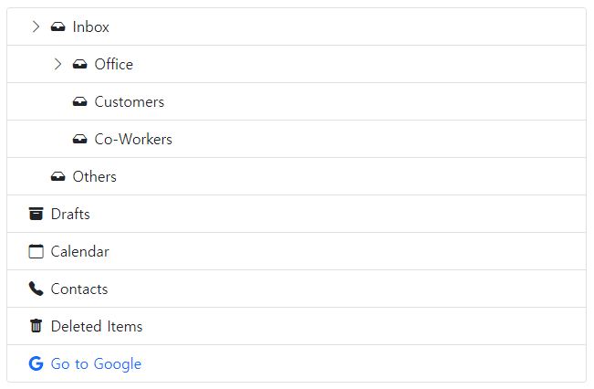

# Vanilla-JS Bootstrap 5 Tree View




this is a fork of https://github.com/nhmvienna/bs5treeview. For use without JQuery.

A very simple plugin to build a basic and elegant Treeview with bootstrap 5.


## Dependencies

Where provided these are the actual versions bootstrap-treeview has been tested against.

- [Bootstrap v5.2](http://getbootstrap.com/)

### Usage

Add the following resources for the bootstrap-treeview to function correctly.

```html
<!-- Required Stylesheets -->
<link href="bootstrap.css" rel="stylesheet">

<!-- Required Javascript -->
<script src="bstreeview.js"></script>
```

The component will bind to any existing DOM element.

```html
<div id="tree"></div>
```

Basic usage may look something like this.

```javascript
const getTree = () => {
  // Some logic to retrieve, or generate tree structure
  return data;
}

const tree = new bstreeview(document.querySelector("#tree"), { data: getTree() });
```


## Data Structure

In order to define the hierarchical structure needed for the tree it's necessary to provide a nested array of JavaScript objects.

Example

```javascript
const json = [
  {
    text: "Inbox",
    icon: "bi bi-inbox-fill",
    nodes: [
      {
        text: "Office",
        icon: "bi bi-inbox-fill",
        nodes: [
          {
            icon: "bi bi-inbox-fill",
            text: "Customers",
          },
          {
            icon: "bi bi-inbox-fill",
            text: "Co-Workers",
          },
        ],
      },
      {
        icon: "bi bi-inbox-fill",
        text: "Others",
      },
    ],
  },
  {
    icon: "bi bi-archive-fill",
    text: "Drafts",
  },
  {
    icon: "bi bi-calendar",
    text: "Calendar",
  },
  {
    icon: "bi bi-telephone-fill",
    text: "Contacts",
  },
  {
    icon: "bi bi-trash-fill",
    text: "Deleted Items",
  },
  {
    icon: "bi bi-google",
    text: "Go to Google",
    class: "link-primary",
    href: "https://google.com",
  },
];
```

This property `text` is required to display nodes.

```javascript
{
  text: "Node 1"
}
```

### Node Properties

#### text
`String` `Mandatory`

The text value displayed for a given tree node.

#### icon
`String` `Optional`

The icon displayed on a given node.

#### href
`String` `Optional`

A custom `href` attribute value for a given node.

#### class
`String` `Optional`

A class name or space separated list of class names to add to a given node.

#### id
`String` `Optional`

ID attribute value to assign to a given node.

#### expanded
`Boolean` `Optional`

Set to true to expand this node's children initially

## Options

#### data
`String` `Mandatory`

Json or string array of nodes.

#### expandIcon
`String` `Optional`

Expand icon class name, default is `fa fa-angle-down fa-fw`.

#### collapseIcon
`String` `Optional`

Collapse icon class name, default is `fa fa-angle-right fa-fw`.

#### indent
`number with decimals` `Optional`

Custom indent between node levels (rem), default is `1.25`.

#### parentsMarginLeft
`String` `Optional`

margin-left value of parent nodes, default is `1.25rem`.

#### openNodeLinkOnNewTab
`Boolean` `Optional`

Open node link on new browser Tab, default is `true`.

```javascript
// Example: initializing the bstreeview
new bstreeview(document.querySelector("#tree"), {
  data: data,
  expandIcon: 'bi bi-chevron-down',
  collapseIcon: 'bi bi-chevron-right',
  indent: 1.25,
  parentsMarginLeft: '1.25rem',
  openNodeLinkOnNewTab: true
});
```

## Methods


## Events


## Copyright and Licensing
Copyright 2020 Sami CHNITER

Licensed under the Apache License, Version 2.0 (the "License");
you may not use this file except in compliance with the License.
You may obtain a copy of the License at <http://www.apache.org/licenses/LICENSE-2.0>

Unless required by applicable law or agreed to in writing, software
distributed under the License is distributed on an "AS IS" BASIS,
WITHOUT WARRANTIES OR CONDITIONS OF ANY KIND, either express or implied.
See the License for the specific language governing permissions and
limitations under the License.
